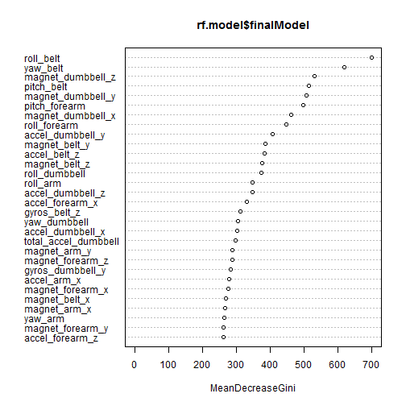

## Overview
The goal of the project is to predict the manner in which the 6 participant did the exercise. The response or outcome is the "classe" variable in the training set and any variables can be use as the predictors based on the data from accelerometers on the belt, forearm, arm, and dumbell of 6 participants. They were asked to perform barbell lifts correctly and incorrectly in 5 different ways. More information is available from the website here: http://groupware.les.inf.puc-rio.br/har (see the section on the Weight Lifting Exercise Dataset). 

## Data
Loading the training and testing datasets

```r
library(caret)
library(randomForest)

train.file <- "https://d396qusza40orc.cloudfront.net/predmachlearn/pml-training.csv"
test.file <- "https://d396qusza40orc.cloudfront.net/predmachlearn/pml-testing.csv"

training <- read.csv(train.file, na.strings=c("NA","#DIV/0!",""))
testing <- read.csv(test.file, na.strings=c("NA","#DIV/0!",""))

dim(training)
```

```
## [1] 19622   160
```

```r
#names(training)
```

## Features
The first 7 columns are indexes and are filtered out from the datasets. Predictors with NAs are also removed from the datasets. This reduces the predicters to 52 for the prediction modeling.

```r
training <- training[,-(1:7)]
keep.cols <- apply(training,2,function(x) {sum(is.na(x))} )
training <- training[,keep.cols==0]
dim(training)
```

```
## [1] 19622    53
```

```r
testing <- testing[,-(1:7)]
testing <- testing[,keep.cols==0]
```

## Modeling

Based on the description of the project and dataset, this is a classification problem. The outcome "classe" is a categorical or qualitative response. I picked random forest method to predict qualitative response. Since there is minimum information on the dataset and random forest modeling is treated as a black-box. The method works well with both continuous and categorical responses, provides Out-of-Bag error (Out-of-Sample) and variable importance information.I picked 3-fold cross validation due to compute time.


```r
set.seed(2805)

rf.model <- train(classe~., data=training, method="rf",
                  trControl=trainControl(method="cv", number=3),
                  prox=TRUE, allowParallel=TRUE)

print(rf.model, digits = 4)
```

```
## Random Forest 
## 
## 19622 samples
##    52 predictor
##     5 classes: 'A', 'B', 'C', 'D', 'E' 
## 
## No pre-processing
## Resampling: Cross-Validated (3 fold) 
## Summary of sample sizes: 13081, 13081, 13082 
## Resampling results across tuning parameters:
## 
##   mtry  Accuracy  Kappa   Accuracy SD  Kappa SD 
##    2    0.9934    0.9916  0.0009833    0.0012440
##   27    0.9929    0.9910  0.0006184    0.0007826
##   52    0.9863    0.9827  0.0020656    0.0026134
## 
## Accuracy was used to select the optimal model using  the largest value.
## The final value used for the model was mtry = 2.
```


```r
rf.model$finalModel
```

```
## 
## Call:
##  randomForest(x = x, y = y, mtry = param$mtry, proximity = TRUE,      allowParallel = TRUE) 
##                Type of random forest: classification
##                      Number of trees: 500
## No. of variables tried at each split: 2
## 
##         OOB estimate of  error rate: 0.43%
## Confusion matrix:
##      A    B    C    D    E class.error
## A 5580    0    0    0    0 0.000000000
## B   12 3782    3    0    0 0.003950487
## C    0   17 3403    2    0 0.005552309
## D    0    0   42 3172    2 0.013681592
## E    0    0    0    6 3601 0.001663432
```
The study of error estimates for bagged classifiers in Breiman [1996b], gives empirical evidence to show that the out-of-bag estimate is as accurate as using a test set of the same size as the training set. 

The OOB(Out-Of-Bag) error:**0.43%** suggests that the modeling has **99.57%** out of sample accuracy for the training set. For the above modeling ,the expected out of sample error is approximately **0.43%**.


Variable Importance of the predictors used in the modeling

```r
varImp(rf.model)
```

```
## rf variable importance
## 
##   only 20 most important variables shown (out of 52)
## 
##                      Overall
## roll_belt             100.00
## yaw_belt               85.83
## magnet_dumbbell_z      70.83
## pitch_belt             67.88
## magnet_dumbbell_y      66.67
## pitch_forearm          64.95
## magnet_dumbbell_x      58.67
## roll_forearm           56.32
## accel_dumbbell_y       49.28
## magnet_belt_y          45.69
## accel_belt_z           45.44
## magnet_belt_z          44.16
## roll_dumbbell          43.61
## roll_arm               39.05
## accel_dumbbell_z       39.04
## accel_forearm_x        36.23
## gyros_belt_z           32.79
## yaw_dumbbell           31.82
## accel_dumbbell_x       31.49
## total_accel_dumbbell   30.46
```

```r
varImpPlot(rf.model$finalModel)
```

 


## Evaluation

```r
predictions <- predict(rf.model, newdata=testing)
predictions
```

```
##  [1] B A B A A E D B A A B C B A E E A B B B
## Levels: A B C D E
```

## Prediction Assignment Submission 

```r
pml_write_files = function(x){
  n = length(x)
  for(i in 1:n){
    filename = paste0("problem_id_",i,".txt")
    write.table(x[i],file=filename,quote=FALSE,row.names=FALSE,col.names=FALSE)
  }
}

pml_write_files(predictions)
```
